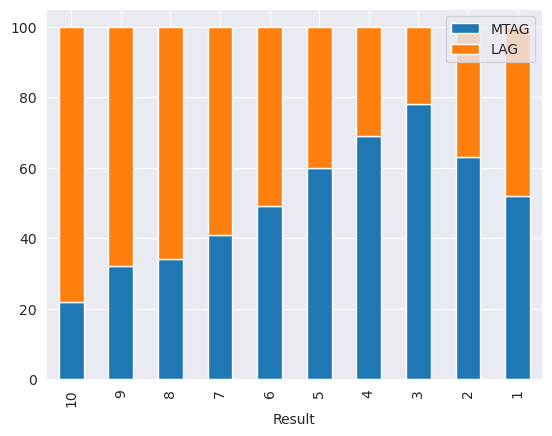
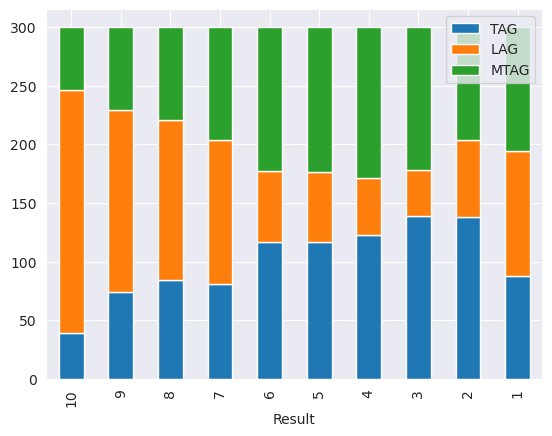
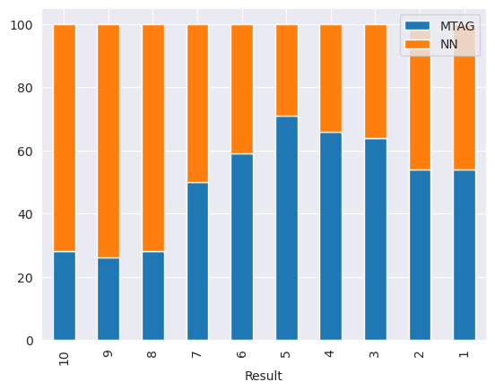

# DeepShark

## Overview

The name of the project, DeepShark, is a compounding of the phrases "deep learning" and "card shark."  Deep learning refers to machine learning methods that utilize artificial neural network architectures, while a "shark" is slang for a highly skilled poker player.  I would like to train an ANN to play poker well, hence DeepShark.  The DeepShark image above was generated using Bing's AI image creator.

### Goals of DeepShark

I have successfully used deep reinforcement learning on the games of [Minesweeper](https://github.com/AlexMGitHub/Minesweeper-DDQN) and [Checkers](https://github.com/AlexMGitHub/Checkers-MCTS).  Those RL implementations were written entirely in Python, and as a result generating training data became a computational bottleneck.  My goals for this project are:

1. Learn "modern" C++ and use it to create the Texas Hold 'Em game environment.

2. Make the C++ game environment accessible to Python code using the `ctypes` Python library.

3. Train a neural network to play poker in Python and have it interact with the C++ game environment.

Accomplishing the above goals will create a new hybrid deep RL workflow that allows me to use the powerful AI/ML tools available in Python, while gaining the computational benefit of generating training data using C++.  

### Development Environment

DeepShark was developed using Windows Subsystem for Linux (WSL) with an Ubuntu image.  The reported g++ compiler version used for the C++ code is:

`g++ (Ubuntu 11.4.0-1ubuntu1~22.04) 11.4.0`

There is some non-portable code (e.g. system("clear") to clear the terminal) that will not run in a non-Linux environment.

I wrote the Python code using Python 3.11.5.  A *requirements.txt* file is included for convenience.

LibTorch is required to execute a trained PyTorch model in C++.  See the [Executing a Trained Neural Network in C++](#executing_a_trained_neural_network_in_c++) section for details.

## Description of the Poker Environment

The Texas Hold 'Em poker environment runs a poker tournament with up to 10 players at the table.  The tournament has a blinds schedule that increases the size of the blinds after a user-specified number of games.  This replicates the effect of time-based blinds schedules that are used in real poker tournaments to prevent tournaments from dragging on too long.

I created a struct that stores the current game state, and this game state is passed along from function to function and modified as the players progress through the various betting rounds.  The game state structs for a particular game are stored in another game history struct, and when the game is over the game history struct is stored in a tournament history struct.  In this way the environment stores every state of every game played during the tournament.  I wrote a serialization routine to write the contents of the tournament history to a binary file and save it to disk.

Texas Hold 'Em is a relatively simple game, but there are three areas that were tricky to implement:

1.  Determining each player's best five-card poker hand from the available cards

2.  Determining when the betting round has ended, particularly if betting can continue after a player has gone all-in

3.  Determining the winner of the game and accounting for ties and side pots

I wrote both unit tests and functional tests that helped me catch many bugs in the above functionality.  I also wrote a user interface using @p-ranav's [tabulate](https://github.com/p-ranav/tabulate) table maker library.  The user interface allowed me to watch each game play out action-by-action, which was useful for debugging the game environment code.  It's also useful for playing back deserialized games that have been recorded to disk.

### Implementing the Game Environment in C++

I wrote the Texas Hold 'Em game loop in C++.  My previous deep reinforcement project [Checkers-MCTS](https://github.com/AlexMGitHub/Checkers-MCTS) was written entirely in Python, and the slow performance of the checkers game environment became an issue when generating training data.  I experimented with using the `ctypes` Python library to run C functions from Python scripts for my [PyCEM](https://github.com/AlexMGitHub/PyCEM) FDTD simulator, which provided the speed of the C language with the convenience of writing the user interface in Python.

The PyCEM experiment with `ctypes` was a success, but I ran into issues getting C to do what I wanted it to do.  I appreciated the performance and control provided by the C language, but I was frustrated by its quirks and lack of high-level language features.  "Modern" C++ appeared to be the best of both worlds: the performance of C with a standard library that provides many high-level language features.  The `ctypes` Python library is not compatible with C++, but because C++ is essentially a superset of C it is possible to work around this limitation.

I compiled a shared library of the poker game loop that was written using C++ code, but I created C wrapper functions to interface with `ctypes`.  This is done by using the `extern "C"` specification when declaring the wrapper functions in the C++ header file.  This specification prevents the C++ compiler from engaging in "name mangling" which is used in C++ to support function overloading.  The wrapper functions must only use "Plain Old Data" (POD) - that is, basic C data types - as the return type and argument types in the declaration.  However, the bodies of these wrapper functions can use C++ code.

The performance of the game environment in C++ is impressive.  I wrote a player AI that runs a 1000-game Monte Carlo simulation every time it makes a decision post-flop.  Even so, a 10-player tournament with hundreds of games only takes seconds to run.  I also used multithreading in C++ to run multiple tournaments in parallel.  With four parallel threads it only takes about three minutes to simulate 100 poker tournaments.

### Initial "Dumb" AI Players

I needed to be able to test the poker environment to ensure that the game rules were properly implemented.  I did this by writing "dumb" (i.e. hard-coded) AI player classes to play out poker games.  The first "AI" that I created was a purely random player who would randomly choose from the list of legal actions.  If the chosen action was a bet or raise, the AI would randomly choose a value between the minimum bet and the maximum value of its chip stack.

This very simple AI allowed me to test out my user interface, serialization/deserialization code, and catch some bugs in the poker environment.  But once the code seemed functional I added another "scripted" AI class that accepts a pre-planned list of actions to take.  I used these scripted AI players to perform functional testing of the code by devising a few scripted scenarios that involved complicated end-game logic such as multiple side pots and ties.  This testing allowed me to catch a few subtle bugs in the poker code which led to improper payouts when there were multiple winners.

#### Heuristic AI

I next wanted to write an AI class that would play somewhat intelligently but still maintain a stochastic nature.  This AI could play out longer and more realistic poker tournaments and possibly even be used to generate initial training data for a neural network.  I wanted this AI to have a rough idea of the strength of its current hand, but not get too bogged down into calculating complicated drawing odds and outs for a particular hand.

I called this class of dumb AIs the "heuristic" AI, as I used some basic poker rules of thumb to guide its decision making.  I combined these rules of thumb with a Monte Carlo simulation to assess the strength of the player's current position.  I found that math for calculating poker odds quickly gets complicated [[1]](#references), and a Monte Carlo simulation will get me a good enough answer to make reasonable decisions.  I only run Monte Carlo simulations during post-flop rounds, as pre-flop I judge the strength of the player's hand by the player's position at the table and whether the player's hole cards are contained in a list of strong starting hands.  I obtained the lists for a tight aggressive player (TAG) from [[2]](#reference), and added additional strong hands to the list for a loose aggressive player (LAG).  The TAG and LAG AI have identical play styles; the only difference is that the LAG is willing to play a larger number of starting hands than the TAG.

The Monte Carlo simulation adds a stochastic element to the AI's decision making as I used the resulting expected win probability in combination with pot odds to determine the player's action.  The pot odds are calculated as the ratio of the chips required to call the bet divided by the total amount of chips in the pot assuming that you call.  If the expected win percentage is larger than the pot odds, then it is worth calling as in the long-run you are expected to win more money than you would lose.  The pot odds are the ratio of the amount of money the player is risking by calling the bet to the amount of money the player could potentially win.  Intuitively, if the pot odds are small then we are risking a relatively small amount of money to win a lot of money.  The smaller the pot odds (as a percentage) and the larger the probability of winning, the stronger the player's position.  

For situations where the pot odds and win probability are nearly equal, I used a uniform distribution to add further stochasticity to the player's decision making.  For example, if the ratio of the probability of winning to the pot odds is greater than a uniform random number between 0 and 1, then the player calls.  Otherwise the player checks or folds.  This prevents the AI from always folding to big bluffs, but still gives a probability of folding proportionate to how weak the hand is.  The expected result is a player AI that will typically make reasonable decisions based on the strength of its current hand, but can unpredictably take actions such as bluffing on a weak hand, calling another player's bluff, etc.

### Comparing Play Styles

Poker playing styles tend to fall along a two-axis spectrum: players can be "tight" or "loose", and "aggressive" or "passive."  A loose play style describes a player who plays a wide range of starting hands.  A tight player plays a narrower range of strong starting hands.  Passive players tend to often check or call and rarely bet or raise large amounts, whereas aggressive players are the opposite.  

I initially created two play styles for the heuristic AI: tight-aggressive (TAG) and loose-aggressive (LAG).  Passive play is considered to be a poor play style used by beginners - if you have a good hand it is almost always better to bet aggressively and force the other players to make hard choices.

I compared the TAG and LAG players in more detail in the Jupyter notebook `heuristic_tournament_results.ipynb`.  In summary, the LAG players were much more likely to be eliminated early on in the tournament compared to the TAG players, but surprisingly a LAG player won the tournament more often than a TAG player.

Out of 100 10-player tournaments with 5 LAG players and 5 TAG players in each, the LAGs won 52 of the tournaments and the TAGs won 48 tournaments:

The horizontal axis of the above plot is labeled "Result."  A result of 10 means 10th place - being eliminated first.  A result of 1 means 1st place - winning the tournament.

This indicated to me that the TAG player might be too tight.  As the number of players at the table dwindles, a wider array of starting hands become viable.  In addition, the blinds schedule increases the size of the blinds as the tournament continues, meaning that the price of folding viable starting hands becomes prohibitive.

To test my theory, I created a third play style called "Modified Tight-Aggressive" (MTAG) that played the same starting hands as the TAG player up until there were 3 or fewer players left in the tournament.  At that point the MTAG uses the same list of starting hands as the LAG.

The pattern seems to hold with all three play styles in one tournament.  The LAG players still tend to be eliminated early in the tournament, and yet the LAGs won exactly as many tournaments as the MTAGs.  The TAGs and MTAGs had very similar early-tournament performance, but the MTAG took home more tournament wins than the TAG.

Overall, the MTAG appears to be a good compromise between the too-tight TAGs and the too-loose LAGs.

## Deep Learning

### Considerations for Neural Network Architecture

One point of consideration is whether the neural network architecture ought to be some sort of recurrent neural network that remembers previous states.

Without memory, the neural network will essentially just be learning how strong a particular poker hand is.  This functionality could be easily reproduced by a look-up table.  An ANN with memory of previous states could identify player behavior patterns.  As mentioned previously, poker playing styles fall along a two-axis spectrum of "tight" or "loose" and "aggressive" or "passive."  The resulting four quadrants describe play styles that could be identified and exploited by an opponent.  For instance, a loose and aggressive play style describes a player who plays a wide range of starting hands and bets aggressively - which means that they are often bluffing.  An observant opponent might notice this tendency to play weak hands and bluff, and be more likely to call their raises.  Similarly, a tight and aggressive player will only play a narrow range of hands and will bet aggressively when he has good cards.  An observant player would be less likely to call their bets as they probably aren't bluffing, and may be able to steal blinds if the player is too tight.

On the other hand, it's not clear to me that a neural network with memory will be able to identify play styles.  The training data will consist of many tournaments from the perspective of all of the players at the table.  In other words, a 10-player tournament will be used to train the neural network ten times - as if it were playing as each of the ten players.  Could a large enough set of training data and a deep enough network learn to look back at a player's history and suss out patterns?  Perhaps, but I don't intend to go to such lengths for this project.

I have chosen to limit the ambition of this project to training a simple neural network architecture on a relatively small amount of training data.  The desired goal is to produce a network that can mimic the level of play of the heuristic AIs, and to have that neural network model make predictions directly within the C++ game environment.  Achieving these goals would provide the building blocks necessary to perform computationally efficient deep reinforcement learning, which was lacking in the much more ambitious [Checkers-MCTS](https://github.com/AlexMGitHub/Checkers-MCTS) project.  In that project the bottleneck was generating training data through self-play due to Python's slow speed in executing the game environment.  I can use what I've learned in this project to generate training data in C++ going forward, hopefully on more meaningful projects than a simple poker AI.

### Executing a Trained Neural Network in C++

Assuming that I train a neural network using the extensive Python ML/AI ecosystem, the next question was how to then execute that trained model within the C++ game loop.  After a brief search, I found that PyTorch [has a workflow](https://pytorch.org/tutorials/advanced/cpp_export.html) for exporting a trained PyTorch model to disk that can be loaded and executed from C++.

### Mapping the C++ Game State to a Neural Network Input

I converted the C++ game state into an array of doubles that represented various important information.  For instance, I used one-hot encoding to represent the suit of the cards in the player's hand and on the table.  The rank of the cards was a single double scaled between 0 and 1 by the maximum rank of an Ace.  Chip quantities were similarly scaled by the total number of chips in the game.  The game state is represented by a total of 60 inputs.

The labels for the data are also contained in the game state.  They are the player's chosen action and resulting bet amount.  The chosen action is one-hot encoded to represent each of the 7 possible player actions, while the player bet is a single value scaled to between 0 and 1 by dividing the bet by the player's chip count.

More details can be found in Appendix C of `docs/notes/appendices.md`.

### Neural Network Architecture

The neural network architecture accepts the vector of inputs extracted from the C++ game state.  There are four hidden "dense" or fully connected layers.  The input layer accepts 60 input features and the output is 8 features.

I implemented this neural network using PyTorch in the Jupyter notebook `train_nn.ipynb`.  The final layer's 8 outputs are split into two quantities: 7 logits representing the 7 possible legal actions, and 1 output that is put through a Sigmoid function to constrain the value between 0 and 1.  This value represents the player's bet as a fraction of the player's total chip stack.

The loss function is an equally-weighted sum of the cross-entropy loss of the action logits and the MSE loss of the player bet.  The network is simultaneously being trained on a classification problem (which action to select) and a regression problem (how much money to bet).

### Reinforcement Learning

I do not implement a "value head" as used by *AlphaGo* and my [Checkers-MCTS](https://github.com/AlexMGitHub/Checkers-MCTS) project.  I don't intend to train the neural network through self-play and so there is no need for a value head to provide truncated rollouts during a MCTS search.  This also illustrates the limitation of using poker as the game environment - there isn't much benefit from using a neural network to evaluate potential future moves in the same way as in board games like Go or checkers.  These games have sizable branching factors which make random rollouts less effective, whereas for poker it just makes more sense to do a simple Monte Carlo simulation and estimate your probability of winning the hand.

## Training the Neural Network

I wrote a C++ function that reads a recorded tournament data file and converts each game state into a vector representing the neural network inputs and the training label (player action and bet).

I compiled this function into a C shared library that is accessible using `ctypes` in Python, and converted 100 tournaments into a single binary file representing the training data, and an additional 20 tournaments into a file representing the test data.  Each training and test tournament had a unique seed and only contained ten MTAG players at the table.  I thus intended to have the neural network learn to mimic the MTAG play style.

I created a custom dataset class to read in the binary data and return individual inputs and labels.  The details can be found in `train_nn.ipynb` in the `src/deepshark/Jupyter/` directory.

### Imbalanced Dataset

The training loop outputs the network's classification accuracy on the legal actions at the end of each epoch of training.  Imagine my surprise when the classification accuracy quickly shot up to over 89% after just a few epochs!

I quickly realized the issue: the MTAG play style folds probably 85 to 90% of the hands that it is dealt.  Therefore I have a classification problem with an extremely imbalanced data set, and the neural network learned to just predict "fold" every time.

To account for this imbalance I used the "weights" argument of the `CrossEntropyLoss()` class, and weighted the "fold" action by 0.1 and every other action by a factor of 5.  This prevents the neural network from dramatically reducing the training loss by just predicting fold every time, and forced it to actually learn which action to select based on the input features.

I ran training for 100 epochs, and chose to use the model from the epoch with the best classification accuracy on the test data (about 94% accuracy).

### Implementing the Neural Network Model in C++

The PyTorch tutorial [[4]](#references) must be converted to Torch Script to be used by the LibTorch C++ API.  For my simple network, the model can be "traced" by sending a single input through the network.  The resulting traced model is saved to disk and can be loaded and executed by LibTorch.

I was able to do this with the minimal C++ example provided by the PyTorch tutorial.  The wrinkle is that the minimal example uses `CMake` to build LibTorch.  Up to this point I had been using `Make` to execute makefiles for creating both my test executables and the shared library.

I had to take a crash course on `CMake` to figure out how to integrate LibTorch into my existing project.  I found the tutorial [[5]](#references) on "Modern CMake" by Henry Schreiner to be the most helpful.  After some fiddling with `CMake` and doing some experimentation with the C++ API to manipulate tensors, I was ready to write a new player AI class that used neural network inferences to decide the proper move.

I was able to successfully generate tournament result data using the neural network player AI class.  The data generation benefited from multiprocessing to run tournaments in parallel.  I used CPU inferences rather than the GPU, in part because I was uncertain how multiprocessing interacted with a single GPU used for inference.

## Results

I ran the neural network AI through the same scenarios as the MTAG heuristic AI.  The detailed results are available in `neural_network_tournament_results.ipynb`.  The neural network behaved like a slightly worse version of the MTAG, as expected!  The neural network appeared more likely to be eliminated in the earlier portions of the tournament, possibly because it learned to play looser than the MTAG.  This may be because of the weighting I applied to the cross-entropy loss: I reduced the weighting on folding hands and increased the weighting on all of the other actions.  This decreased the penalty for incorrectly predicting the fold action, and increased the relative penalty for incorrectly predicting all of the other possible actions.  

Therefore the neural network might have learned to play weaker hands that were usually only viable at the end of the tournament earlier on in the tournament.  Playing weaker hands earlier (or perhaps being less likely to fold even with a good hand) probably explains why the neural network tended to be eliminated earlier than the MTAG.  Even so, it won nearly as many tournaments as the MTAG (46 to 54)!

It also had performance comparable to the MTAG against the LAG, TAG, and random AI opponents.

## Final Thoughts

DeepShark has successfully achieved the goals that I set out for it.  I have a much stronger understanding of modern C++, and as a bonus I also learned a fair bit about modern CMake, which is the industry-standard build system for C and C++.

I now have a work flow that I can apply to future deep reinforcement learning projects.  I can use PyTorch and the larger Python ecosystem to run a self-play training pipeline that benefits from the speed of C++.

## Acknowledgements

Thanks to @p-ranav for use of his [tabulate](https://github.com/p-ranav/tabulate) table maker library.  I've included copies of his licenses in my repository along with the single header file version of his code.

## References

1. “Texas Hold’em Poker probabilities,” randomprobabilities.net.
http://randomprobabilities.net/texas-holdem.php (accessed Jan. 02, 2024).

2. “Texas Hold’em Guide | A Beginners Guide To Texas Hold’em,” www.thepokerbank.com. https://www.thepokerbank.com/guide/

3. “Strategy: Blind structure - how the blinds increase,” PokerStrategy.com, 2024. https://www.pokerstrategy.com/strategy/live-poker/how-blinds-increase-structure/ (accessed Jan. 02, 2024).

4. “Loading a TorchScript Model in C++ — PyTorch Tutorials 2.2.0+cu121 documentation,” pytorch.org. https://pytorch.org/tutorials/advanced/cpp_export.html (accessed Jan. 03, 2024).‌

5. “An Introduction to Modern CMake · Modern CMake,” cliutils.gitlab.io. https://cliutils.gitlab.io/modern-cmake/

‌